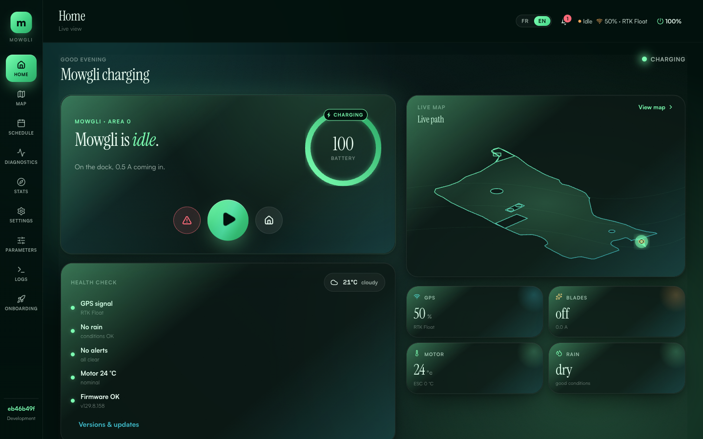

<p align="center">
  <a href="https://docs.ros.org/en/lyrical/">
    
  </a>
  <a href="https://github.com/ros-navigation/navigation2">
    
  </a>
  <a href="https://www.behaviortree.dev/">
    
  </a>
  <a href="https://gtsam.org/">
    
  </a>
  <a href="https://github.com/Fields2Cover/Fields2Cover">
    
  </a>
  <a href="https://github.com/Pepeuch/universal-gnss/releases/tag/v0.7.1-rc3">
    
  </a>
</p>

<p align="center">
  <a href="https://github.com/mowglinext/mowglinext/releases/latest">
    
  </a>
  
  
</p>

<p align="center">
  
</p>


<p align="center">
  
  
  
  
  
  
  
  
  
  
  
</p>

<p align="center">
  <a href="https://mowgli.garden">
    
  </a>
  <a href="https://github.com/mowglinext/mowglinext/wiki">
    
  </a>
  <a href="https://github.com/mowglinext/mowglinext/discussions">
    
  </a>
  <a href="https://github.com/mowglinext/mowglinext/issues">
    
  </a>
  <a href="CONTRIBUTING.md">
    
  </a>
</p>

---

> ## 🌱 First Public Beta — Open to Testers
>
> MowgliNext has reached its **first beta**: a complete autonomous mowing stack running on real hardware — undock, mow, avoid obstacles, dock, resume. We're now inviting testers to run it on their own mowers and help us harden it. Expect rough edges, and tell us what breaks: [open an issue](https://github.com/mowglinext/mowglinext/issues) or [join the discussion](https://github.com/mowglinext/mowglinext/discussions).

---

## What's New in v1.5.0

The mower mows to the edge. Full notes: [v1.5.0 release](https://github.com/mowglinext/mowglinext/releases/tag/v1.5.0).

| | |
|---|---|
| ✂️ **Mows to the edge** | The outermost pass rides on the line you recorded instead of 20 cm inside it, and drawn obstacles are saved at their real size instead of a chassis half-width too big. If your perimeter is not drivable all the way round, read the upgrade notes first. |
| 🔁 **Row ends that stay on the lawn** | Where no turn-around arc fits, the robot pivots in place with the blade on instead of splitting the lawn into dozens of pieces, and it improvises a turn it cannot drive instead of aborting. |
| 🔧 **Firmware settings without a custom build** | E-stop timings, charge ceiling, speed cap and tilt threshold come from your configuration, are clamped to a safety envelope and are kept in flash. Needs a firmware reflash, which the GUI offers after the update. |
| 📡 **GNSS in its own container** | The Universal GNSS receiver runs in its own updatable sidecar; its configuration stays in `mowgli_robot.yaml`. |
| 🌿 **LiDAR ignore lines** | Draw a line along a hedge or ornamental grass: LiDAR returns inside it are ignored, so soft vegetation the robot should brush past no longer stops it. |
| 🏠 **Home Assistant auto-discovery** | Opt-in: the mower appears as one device with start, pause and dock, and a *Mow* button per area. |
| 🛠️ **Installer modes** | `install`, `update`, `repair`, `check` and `uninstall` — a supported manual update path when the GUI updater cannot be used. |
| 🤝 **Multi-robot (beta)** | Several mowers share one property without being assigned the same area. |

## What It Does

A fully autonomous mowing stack running on real hardware: undock, navigate to zones, mow strip-by-strip with sub-centimeter accuracy, avoid obstacles, dock to charge, and resume.

**Core:** GTSAM iSAM2 factor-graph localizer (`fusion_graph`) — sole map+odom localizer (GPS + IMU + wheels, REP-105 map/odom, with an optional LiDAR map anchor that carries the pose through GNSS outages) · Nav2 navigation · BehaviorTree.CPP v4 · multi-area continuous-subpath coverage

**Hardware:** YardForce chassis · ARM64 SBC (RK3566/RK3588, RPi 4/5) · RTK-GNSS via the Universal GNSS runtime (u-blox F9P, Unicore UM98x, or generic NMEA) · LiDAR (LDRobot LD19 / STL27L, RPLIDAR A1) · STM32 firmware

See the **[Architecture wiki page](https://github.com/mowglinext/mowglinext/wiki/Architecture)** for full system design and data flow.

## Dashboard

<p align="center">
  
</p>

State-adaptive hero card with a live mini-map, telemetry tiles, health checks, and contextual actions. Weekly schedule grid, statistics with bar charts, and full Mapbox map editor. Dark-only theme with Visual / Balanced / Efficient display modes, responsive mobile layout.

See the **[GUI wiki page](https://github.com/mowglinext/mowglinext/wiki/GUI)** for all pages and design details.

## Quick Start

Visit [mowgli.garden](https://mowgli.garden/#getting-started) to pick your hardware and get a personalized install command, or:

```bash
curl -sSL https://mowgli.garden/install.sh | bash
```

The website composer and bootstrap installer now target the Universal GNSS runtime only for direct GNSS setups.

GUI at `http://<mower-ip>:4006` · See **[Getting Started](https://github.com/mowglinext/mowglinext/wiki/Getting-Started)** for full setup.

### Updating

Since v1.4.0 the mower updates itself from the web interface. **Settings → Updates** checks for published releases every 24 hours, shows a notice in the bell, and installs the release you review with a backup, a health check and automatic rollback. Nothing is ever installed without your confirmation, and never while the robot is mowing.

**Updating to v1.5.0 changes the mainboard firmware protocol.** In **Settings → Updates**: *Update the update service* first, then *Review update* → *Install*, then use **Flash firmware** when the new interface asks for it. Until the board is reflashed the robot refuses to mow. Details in the [v1.5.0 release notes](https://github.com/mowglinext/mowglinext/releases/tag/v1.5.0).

Mowers installed before v1.4.0 enable it by rerunning the installer once (same answers as the first time):

```bash
curl -sSL https://mowgli.garden/install.sh | bash     # or: cd ~/mowglinext && ./install/mowglinext.sh
```

The installer updates its own checkout (no `git pull` needed): it lists any locally modified tracked file and offers to stash it under a named backup, keep it, or abort. Robot configuration under `docker/` is not tracked by git and is never touched. If `docker/docker-compose.yaml` predates managed updates, the installer asks once before replacing it and keeps the old file as `docker-compose.yaml.legacy-<date>`.

Check `docker volume ls | grep mowgli_maps` first: if your map volume is not prefixed `install_`, set `COMPOSE_PROJECT_NAME=<your prefix>` in `docker/.env` before rerunning so the stack keeps its data. The legacy `mowgli-pull && mowgli-up` helpers still work but are no longer the recommended path. Details, tracks, pins and recovery: [`docs/UPDATES.md`](docs/UPDATES.md).

### Local Webots simulation

The ROS 2 stack also has a Webots simulation for development and integration
testing. See the [ROS 2 simulation instructions](ros2/README.md#running-webots-simulation)
for a clean Docker checkout, browser access, and platform notes.

## Monorepo

| Directory | Description |
|-----------|-------------|
| [`ros2/`](ros2/) | ROS2 stack: Nav2, fusion_graph (GTSAM iSAM2 sole localizer), BT, coverage, hardware bridge |
| [`gui/`](gui/) | React + Go web interface |
| [`firmware/`](firmware/) | STM32 motor control, IMU, blade safety |
| [`install/`](install/) | Interactive installer, hardware presets, modular Docker Compose configs |
| [`docker/`](docker/) | Manual deployment configs, DDS settings, service orchestration |
| [`sensors/`](sensors/) | Dockerized GNSS & LiDAR drivers |
| [`docs/`](docs/) | GitHub Pages at [mowgli.garden](https://mowgli.garden) + the `docs/claude/` reference index |

## Documentation

| Resource | Content |
|----------|---------|
| **[Wiki](https://github.com/mowglinext/mowglinext/wiki)** | Architecture, configuration, deployment, sensors, firmware, BT, GUI, FAQ |
| **[Website](https://mowgli.garden)** | Landing page, install composer, features overview |
| **[First Boot](docs/FIRST_BOOT.md)** | Post-install checklist |
| **[ROS 2 simulation](ros2/README.md#running-webots-simulation)** | Local Webots simulation with Docker |

## A Word About OpenMower

MowgliNext exists because of [OpenMower](https://openmower.de/). They proved robot mowers can be truly intelligent. OpenMower replaces the stock electronics with custom boards; Mowgli works with existing hardware, adding capabilities on top. Different paths, same goal: smarter mowers for everyone. Thank you, OpenMower team.

## Contributing

We welcome contributions! See the [Contributing Guide](CONTRIBUTING.md) and [AI-Assisted Contributing](https://github.com/mowglinext/mowglinext/wiki/AI-Assisted-Contributing).

### Working with Claude Code (or any coding agent)

Start at [`CLAUDE.md`](CLAUDE.md) — safety rules, monorepo layout and the architecture invariants that override everything else. Then load only what you need:

- [`docs/claude/doc-index.md`](docs/claude/doc-index.md) — which document is authoritative and which is a dated record
- [`docs/claude/codemaps/`](docs/claude/codemaps/) — per-area "where to look" maps, plus the nested `CLAUDE.md` in `ros2/`, `gui/`, `firmware/`, `install/`, `docker/`, `sensors/`
- [`docs/claude/ros-interfaces.md`](docs/claude/ros-interfaces.md) · [`parameters.md`](docs/claude/parameters.md) · [`testing-ci.md`](docs/claude/testing-ci.md) — every topic/service/action, every config key, every test and the CI job that gates it

## Acknowledgments

- **[cloudn1ne](https://github.com/cloudn1ne)** — original Mowgli reverse engineering
- **nekraus** — countless late nights making things work
- **[OpenMower](https://openmower.de/)** — proving robot mowers can be intelligent
- **Mowgli French Community** — testing, feedback, encouragement
- **Every Mowgli user** — every install and bug report keeps us going

## License

MowgliNext is published under a **dual license**:

- **GPLv3** for open source, personal, educational, non-profit, and community use.
- For any **commercial use** (selling products, integrating into a sold product, offering SaaS based on it, etc.), a separate commercial license is required. Please contact contact@mowgli.garden to discuss.

See the [LICENSE](LICENSE) file for details.
